<!-- PROJECT LOGO -->
<div align="center">
  <a href="https://github.com/andreihar/knights-and-knaves">
    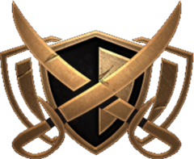
  </a>
  
# Knights and Knaves


<!-- PROJECT SHIELDS -->
[![Contributors][contributors-badge]][contributors]
[![Licence][licence-badge]][licence]
[![LinkedIn][linkedin-badge]][linkedin]

**An immersive online hub for the strategic card-based board game**

A central platform for exploring and engaging with "Knights and Knaves," a dynamic card-based board game. Designed with a mediaeval fantasy theme, the site offers a comprehensive overview of the game's components, rules, and lore.

[Live Demo][demo]


</div>


---


<!-- TABLE OF CONTENTS -->
<details open>
  <summary>Table of Contents</summary>
  <ol>
    <li>
      <a href="#about-the-project">About The Project</a>
      <ul>
        <li><a href="#built-with">Built With</a></li>
      </ul>
    </li>
    <li><a href="#install">Install</a></li>
    <li>
      <a href="#features">Features</a>
      <ul>
        <li><a href="#home-page">Home Page</a></li>
        <li><a href="#characters">Characters</a></li>
        <li><a href="#storyworld">Storyworld</a></li>
        <li><a href="#premise">Premise</a></li>
        <li><a href="#description-of-game">Description of Game</a></li>
        <li><a href="#gallery">Gallery</a></li>
        <li><a href="#team">Team</a></li>
        <li><a href="#cards">Cards</a></li>
        <li><a href="#pdf-links">PDF Links</a></li>
      </ul>
    </li>
    <li><a href="#lighthouse-report">Lighthouse Report</a></li>
    <li><a href="#contributors">Contributors</a></li>
    <li><a href="#licence">Licence</a></li>
  </ol>
</details>


<!-- ABOUT THE PROJECT -->
## About The Project

Knights and Knaves was developed as part of the final project for the course in Introduction to Game Studies in the Spring semester of 2024. This project involved creating an engaging online platform to support and enhance the experience of the strategic card-based game, "Knights and Knaves."

Designed to provide an immersive and comprehensive experience, the website offers detailed insights into the game's mechanics, development logs, storyworld setting, and other necessary components. It presents clear explanations of the rules and gameplay, while also delving into the game's rich lore and narrative. Built with modern web technologies, the site ensures a user-friendly and fully responsive experience, allowing players to fully engage with and understand the game's complexities.

### Built With

* [![React][react-badge]][react]
* [![Vite][vite-badge]][vite]
* [![Bootstrap][bootstrap-badge]][bootstrap]


<!-- INSTALL -->
## Install

Run the app locally:

```bash
$ npm install
$ npm run dev
```

The website can be accessed through the URL `http://localhost:5173/`.


<!-- FEATURES -->
## Features

### Home Page

The Home Page acts as the gateway to the game, featuring an embedded trailer that provides a visual introduction. It also includes sections that outline the game's inspirations and core pillars. This page is designed to immediately convey the essence of the game and its unique elements, offering users a concise overview of what they can expect.

<p align="center">
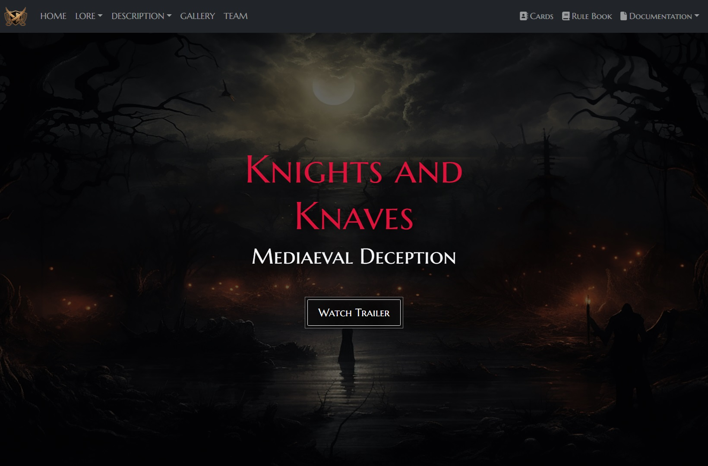
</p>

<p align="center">
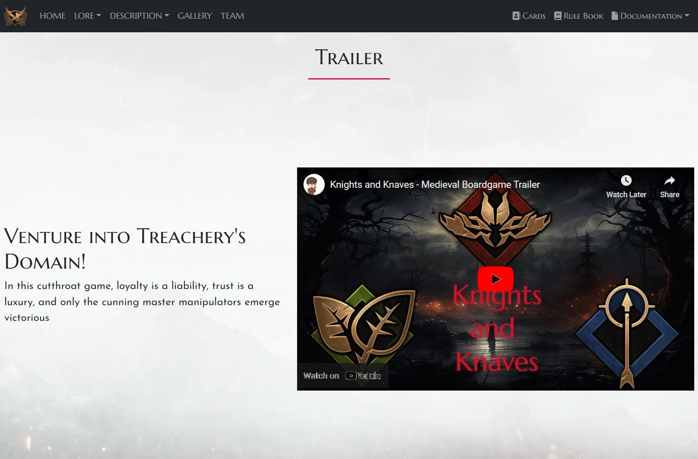
</p>

### Characters

The Characters Page provides an overview of the three factions. Users can explore detailed descriptions of each faction and, by clicking on individual characters, access their biographies. This page offers a comprehensive look at the game's key figures and their roles within their respective factions.

<p align="center">
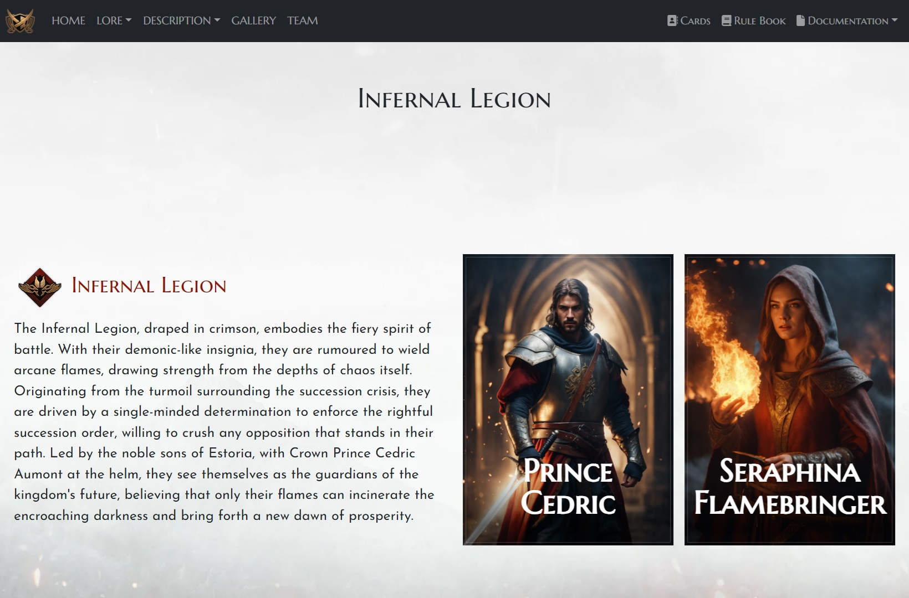
</p>

<p align="center">
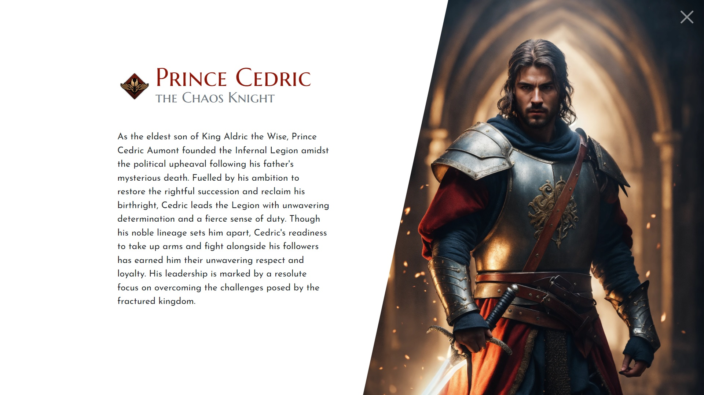
</p>

### Storyworld

The Storyworld Page presents an overview of the various regions featured in the lore of the game. Users can explore a list of these regions, and by selecting each one, they can delve deeper into its background and significance within the game's world.

<p align="center">
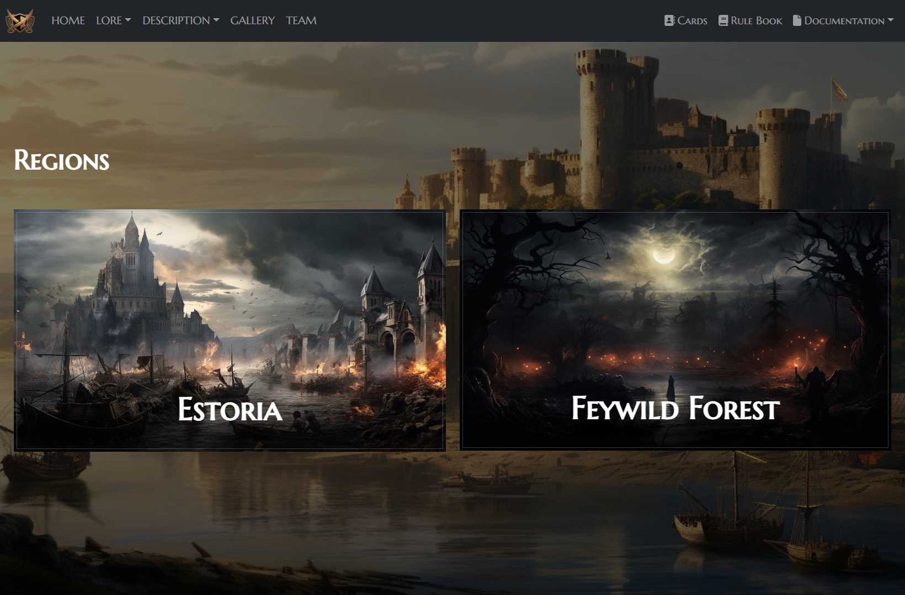
</p>

<p align="center">
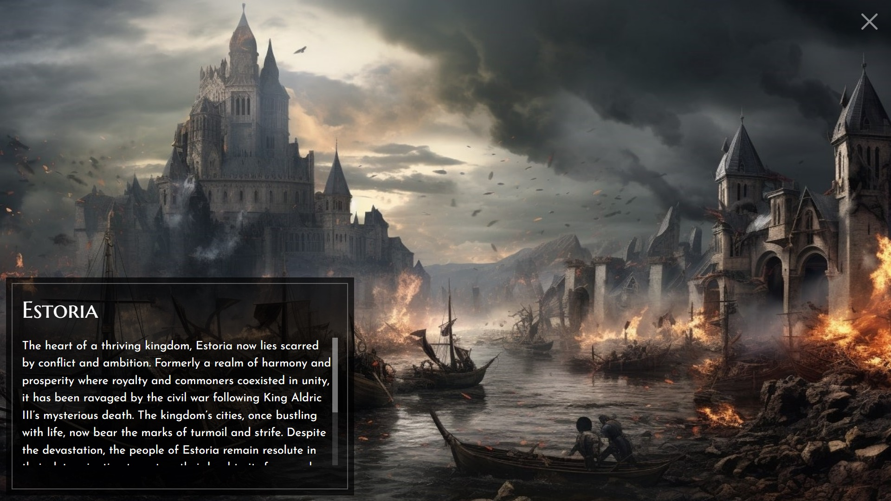
</p>

### Premise

The Premise Page features a timeline presented in a slide format, with each slide detailing significant events that shape the story of the game. This visual timeline helps users understand the chronological progression of key events in the game's lore.

<p align="center">
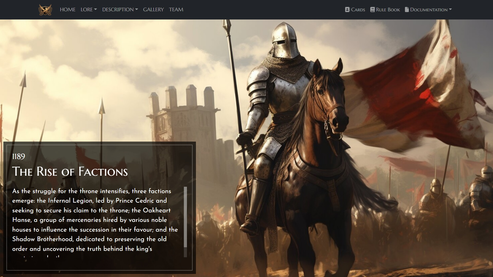
</p>

### Description of Game

The Description Pages offer blog-style entries where users can explore detailed analyses of various aspects of Knights and Knaves. This section covers the game's Dynamics, Trade-Offs, Duration, and Quantitative Analysis, providing a deep dive into the game's mechanics and strategic elements.

<p align="center">
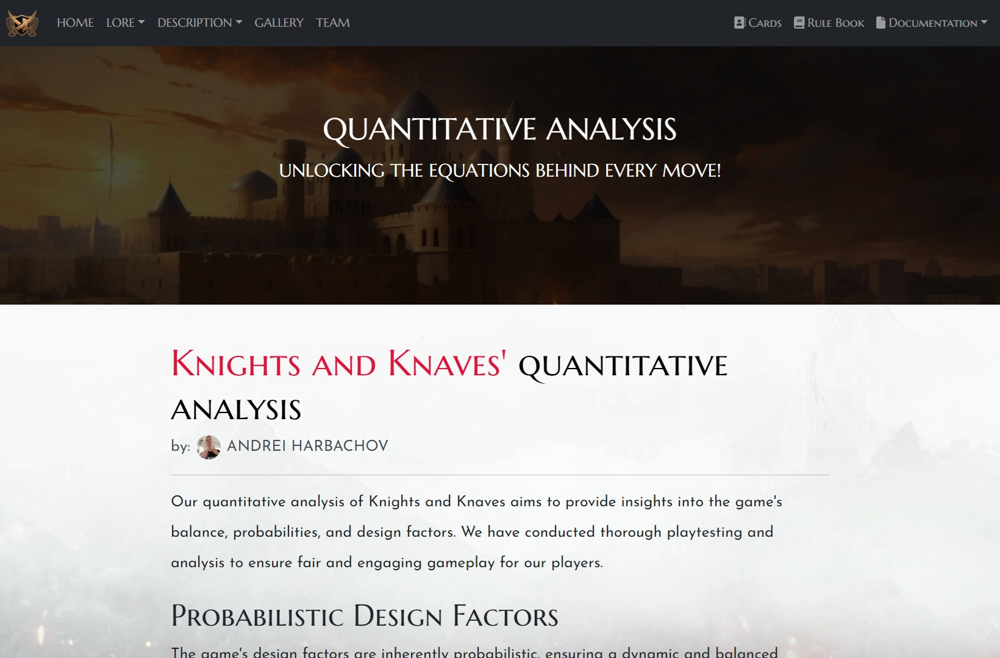
</p>

### Gallery

The Gallery Page offers a collection of images related to the game, including views of the game setup, prototype cards, and other visual elements. Users can click on each image to zoom in and inspect the details more closely.

<p align="center">
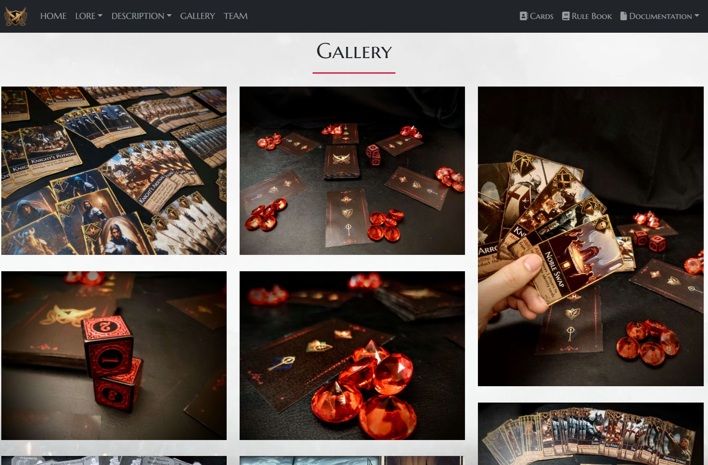
</p>

### Team

The Team Page provides detailed descriptions of each member's role in the development of Knights and Knaves. It also includes visual percent bars to illustrate the contribution of each team member across various aspects of the game development process.

<p align="center">
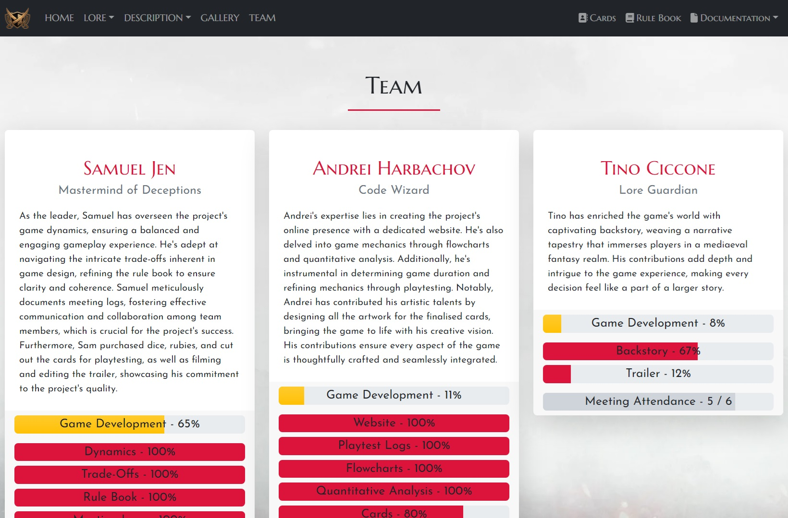
</p>

### Cards

The Cards Page showcases Action, Special, and Identity cards that exist in the game. Users can click on each card to zoom in and inspect them better.

<p align="center">
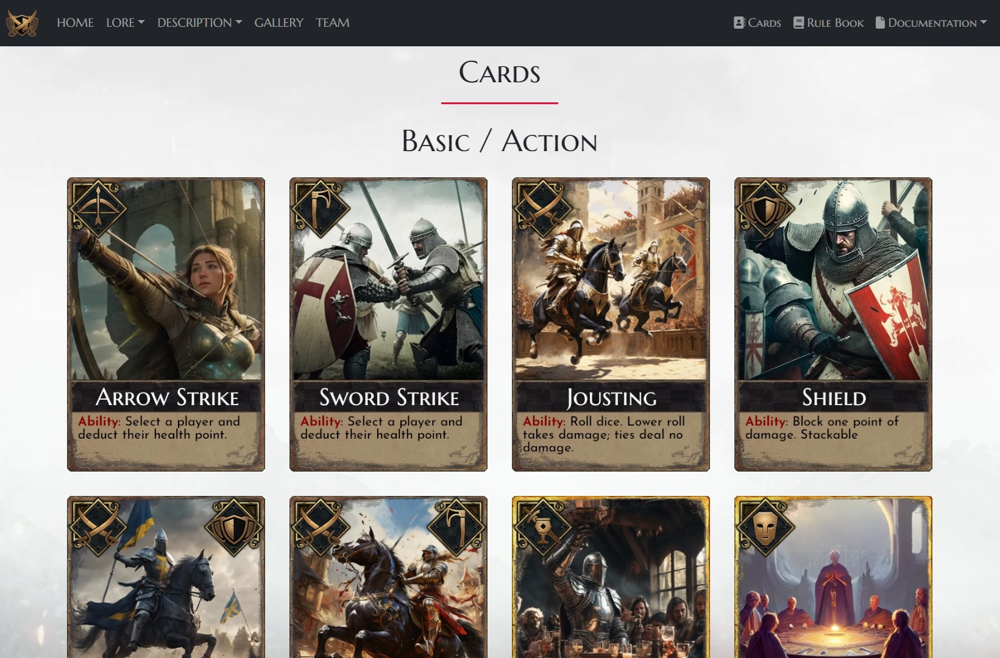
</p>

<p align="center">
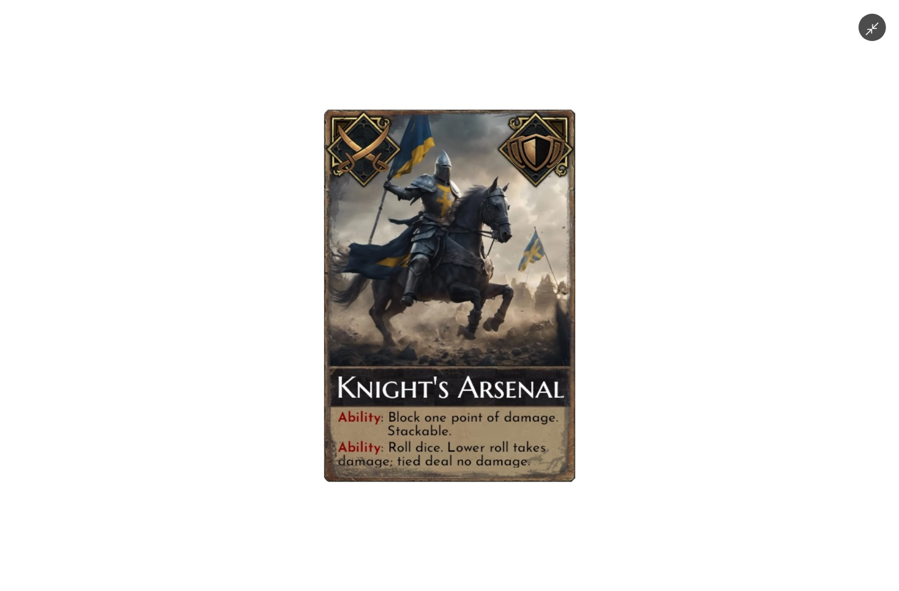
</p>

### PDF Links

The website also features links to several pages with essential PDF files related to the game, including the Rulebook and various documentation like Meeting Logs, Playtest Logs, and Flowcharts.

<p align="center">
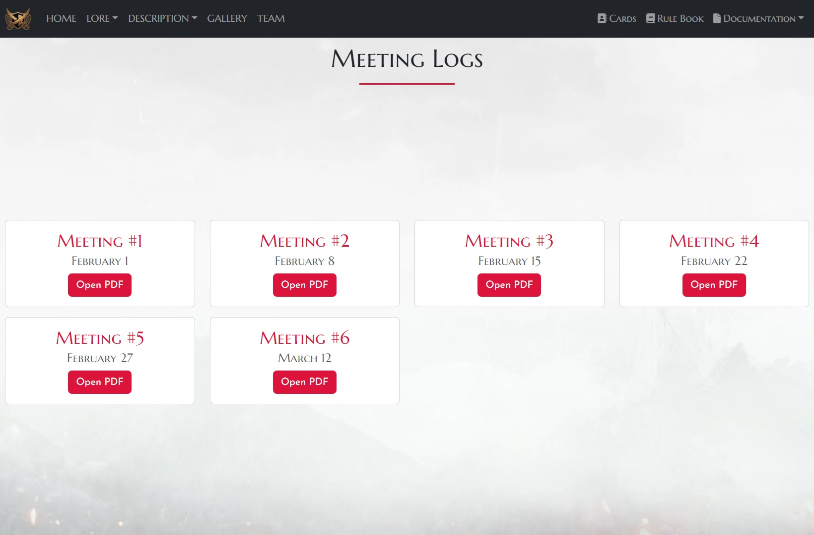
</p>


<!-- LIGHTHOUSE -->
## Lighthouse Report

<p align="center">
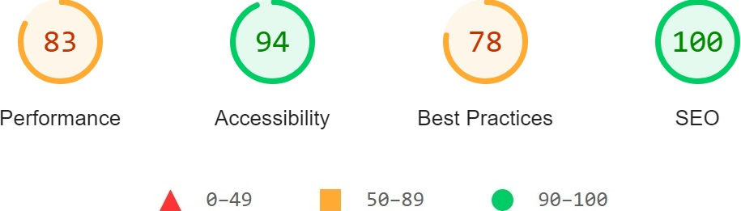
</p>


<!-- CONTRIBUTORS -->
## Contributors

- Andrei Harbachov ([GitHub][andrei-github] · [LinkedIn][andrei-linkedin])


<!-- LICENCE -->
## Licence

Because Knights and Knaves is MIT-licensed, any developer can essentially do whatever they want with it as long as they include the original copyright and licence notice in any copies of the source code.

Please be aware that while the software is MIT-licensed, the content related to the board game—contributed by other team members—is not included under this licence. Responsibility for applying the MIT Licence to this content does not fall under my purview.


<!-- MARKDOWN LINKS -->
<!-- Badges and their links -->
[contributors-badge]: https://img.shields.io/badge/Contributors-1-44cc11?style=for-the-badge
[contributors]: #contributors
[licence-badge]: https://img.shields.io/github/license/andreihar/knights-and-knaves.svg?color=000000&style=for-the-badge
[licence]: LICENSE
[linkedin-badge]: https://img.shields.io/badge/LinkedIn-0077B5?style=for-the-badge&logo=linkedin&logoColor=white
[linkedin]: https://www.linkedin.com/in/andreihar/
[react-badge]: https://img.shields.io/badge/React-087EA4?style=for-the-badge&logo=react&logoColor=ffffff
[react]: https://react.dev/
[vite-badge]: https://img.shields.io/badge/Vite-646CFF?style=for-the-badge&logo=vite&logoColor=ffffff
[vite]: https://vitejs.dev
[bootstrap-badge]: https://img.shields.io/badge/Bootstrap-7B12F8?style=for-the-badge&logo=bootstrap&logoColor=ffffff
[bootstrap]: https://getbootstrap.com/

<!-- Technical links -->
[demo]: https://knights-and-knaves.andreihar.com/

<!-- Socials -->
[andrei-linkedin]: https://www.linkedin.com/in/andreihar/
[andrei-github]: https://github.com/andreihar
